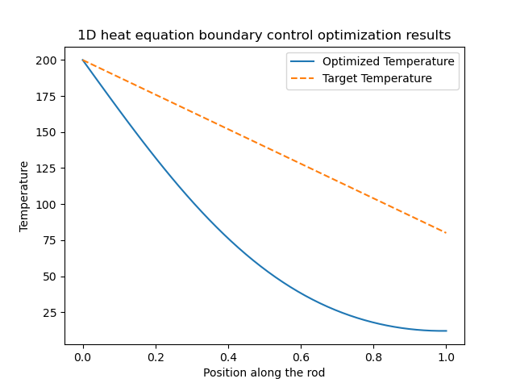
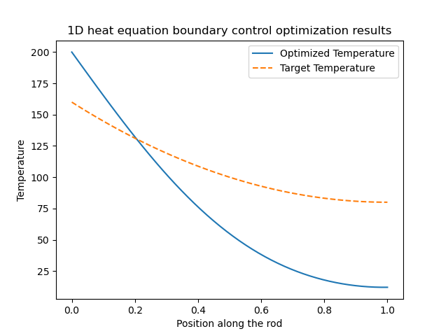
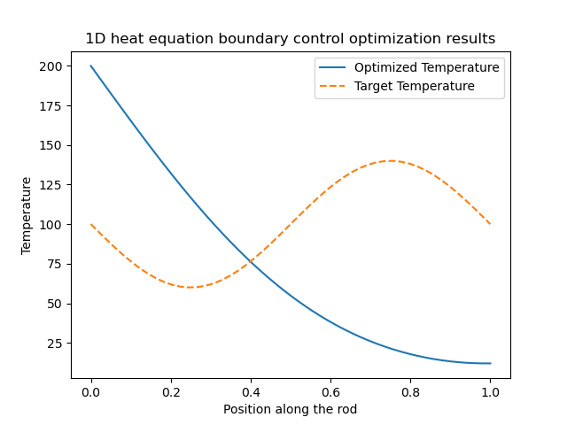

# 1D Heat Adjoint Control
A simple demonstration of solving the 1D heat equation via finite difference methods, and applying an adjoint-based approach to optimize boundary temperature control for a desired temperature distribution.

## Project Overview
Given a 1D heat equation

\[
\frac{\partial u}{\partial t} = \alpha \frac{\partial^2 u}{\partial x^2},
\]

with boundary control on \( x = 0 \) (and optionally on \( x = L \)), we aim to find an optimal temperature profile at the boundary that drives the rod’s temperature toward a user-defined target distribution.

### Approach

1. **Forward Solver**: Uses explicit (or optionally implicit) finite difference to compute \( u(t,x) \).  
2. **Adjoint Solver**: Back-propagates errors (the difference between the final or time-dependent \( u \) and the target distribution \( u_{\text{target}} \)) to obtain gradient information.  
3. **Optimization**: Updates the boundary control(s) based on the computed gradient (simple gradient descent or a line-search strategy).

### Key Features

- **Extensible framework** for PDE-based optimization.
- Easily switch between **different boundary conditions** (Dirichlet, Neumann) or different time discretizations.
- Example scripts illustrating **usage** and **generating plots**.

## File Structure
`src/`: Source code
`examples/`: Example scripts
`docs/`: Documentation
`results/`: Results (visualizations, data)

## Quickstart

1. Clone the repository:
   ```bash
   git clone https://github.com/olia1209/1D-Heat-Adjoint-Control.git

2. Install the project as an editable package:
    ```bash
    pip install -e .

3. Install dependencies:
    ```bash
    pip install -r requirements.txt

4. Run the example:
    ```bash
    python examples/example_run.py

## Usage Notes

- **Multiple boundary controls**:  
  If you want to control both ends of the rod (or implement a time-varying boundary condition), you’ll need to modify the code in `optimize.py` and `forward_solver.py` accordingly. Specifically, you would introduce additional control variables/functions, update the forward solver to use them, and also adjust the adjoint solver to compute the correct gradient contributions for each control.

- **Stability**:  
  If using an *explicit* finite difference scheme, ensure the time step \(\Delta t\) satisfies the CFL stability condition,
  \[
  \alpha \frac{\Delta t}{(\Delta x)^2} \;\le\; \frac{1}{2} 
  \quad (\text{or sometimes } \le \frac{1}{4}),
  \]
  depending on your numerical discretization. Otherwise, the solution may become numerically unstable.

- **Possible Modifications**:
  1. **Switch to an implicit** (e.g., backward Euler) or **Crank–Nicolson** scheme for larger time steps or improved numerical stability.
  2. **Add regularization terms** in the cost function if the control tends to blow up to very large values. For instance,  
     \[
     J = \int_0^L (u - u_\text{target})^2 \, dx 
         + \lambda \int_0^T (\text{boundary\_temp}(t))^2 \, dt.
     \]
     This helps keep the boundary temperature in a reasonable range.

## Examples of Results

Below are some example results where the **blue curve** is the *optimized temperature* at the final time, and the **orange dashed curve** is the *target temperature*:

1. **Linear target**  
   

2. **Parabola target**  
   

3. **Sinusoidal target**  
   

You can experiment with these or your own target distributions by modifying `u_target` in the example scripts or adjusting boundary conditions and solver parameters.
